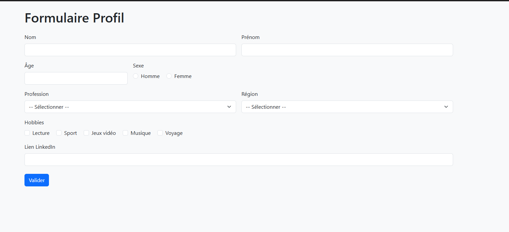
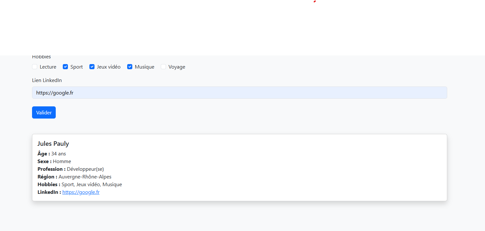

# TP JavaScript DOM : Création et mise à jour d'une carte profil

## Objectif

Créer un petit formulaire HTML permettant à l'utilisateur de saisir des informations personnelles. Lorsqu'il clique sur le bouton **Valider**, une carte de profil s'affiche sous le formulaire avec les informations saisies.  
Si l'utilisateur modifie les champs et revalide, la carte se **met à jour** au lieu d'en recréer une nouvelle.

Nous utiliserons uniquement **JavaScript Vanilla**, sans framework, et **Bootstrap** pour le style.

---

## 1. Structure du formulaire

Tu dois créer un formulaire contenant les champs suivants :

- **Nom** (input texte)
- **Prénom** (input texte)
- **Âge** (input nombre)
- **Sexe** (boutons radio)
    - Homme
    - Femme
- **Profession** (liste déroulante)
    - Étudiant(e)
    - Développeur(se)
    - Enseignant(e)
    - Designer
    - Autre
- **Hobbies** (checkbox, plusieurs choix possibles)
    - Lecture
    - Sport
    - Jeux vidéo
    - Musique
    - Voyage
- **Région** (liste déroulante)
    - Île-de-France
    - Provence-Alpes-Côte d’Azur
    - Bretagne
    - Grand Est
    - Auvergne-Rhône-Alpes
- **Lien LinkedIn** (input texte de type URL)

Un bouton **Valider** doit se trouver en bas du formulaire.

---

## 2. Affichage du profil

Lorsque l'utilisateur clique sur le bouton "Valider", une **carte Bootstrap** doit apparaître sous le formulaire.

La carte doit contenir :

- Le **nom complet**
- L'**âge** et le **sexe**
- La **profession**
- Les **hobbies** sélectionnés
- La **région**
- Un **lien cliquable vers le profil LinkedIn**

Utilise les composants de [Bootstrap Card](https://getbootstrap.com/docs/5.3/components/card/) pour rendre ça plus joli.

---

## 3. Mise à jour de la carte

Si l'utilisateur modifie les données dans le formulaire puis clique à nouveau sur **Valider**, la carte **doit être mise à jour** et **non dupliquée**.

---

## Contraintes techniques

- Utilise `document.querySelector` ou `document.querySelectorAll` pour manipuler le DOM.
- Utilise `createElement`, `append` ou `innerHTML` ou `insertAdjacentHTML` ou `insertAdjacentElemnt` pour générer dynamiquement la carte.
- Ne fais **aucun rechargement de page**.
- Utilise un fichier HTML et un fichier JavaScript séparé.
---

## Conseils : 

- Tu va avoir besoin de preventDefault(); afin de stopper la soumission du formulaire (recherche google)
- Si je peux te donner une marche à suivre : 
- 1 : console.log() pour voir si tu passe bien dans ton script au moment ou ton formulaire est soumis.
- 2 : récupere toutes tes informations du formulaire et console.log() une par une.
- 3 : commence déja par créer l'élément card sans rien dedans, est ce que elle s'affiche ?
- 4 : Dans la card met les information UNE par UNE et test ?
- 5 : bravo
---

## Bonus (facultatif)

- Ajoute une image de profil générique (avatar) dans la carte.
- Ajoute une animation (fade-in ou autre) lors de l'affichage ou mise à jour de la carte.
- Affiche une alerte ou un message d’erreur si certains champs sont vides.

---

## Résultat attendu

Un exemple de rendu visuel :

---

Bonne chance ! 💪
